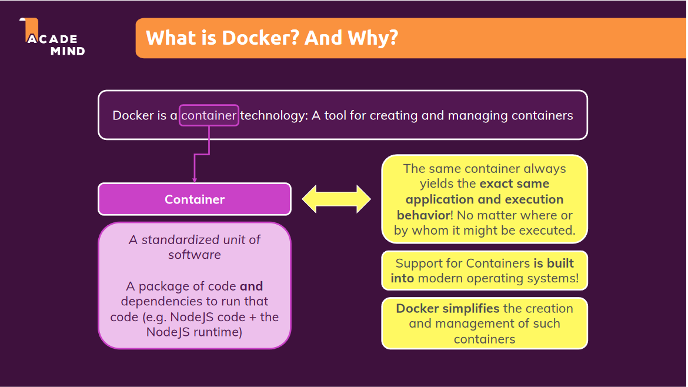
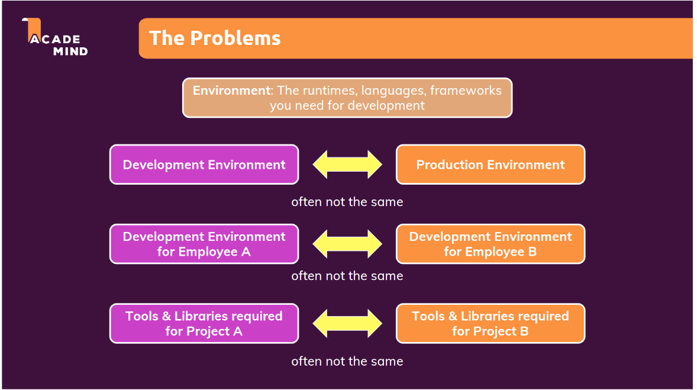
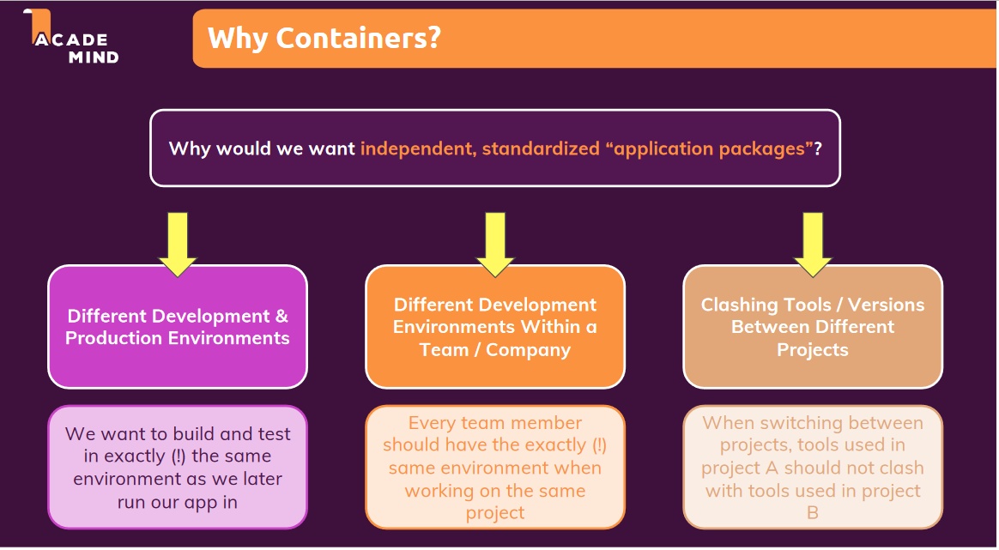
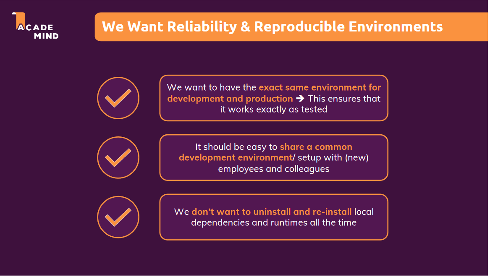
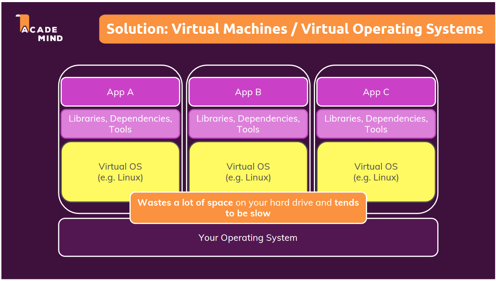
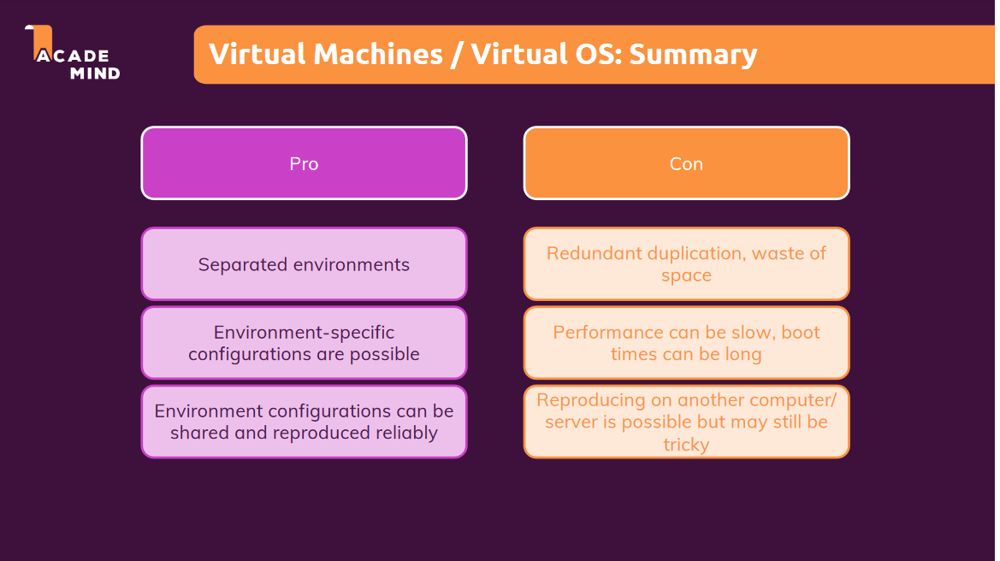
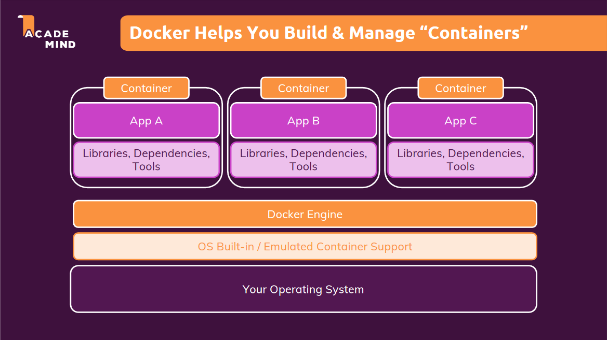
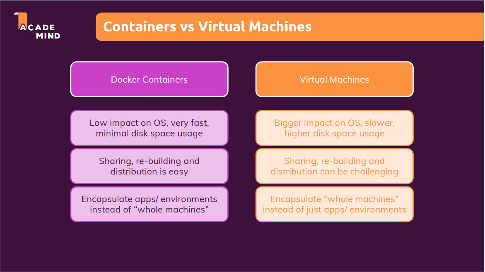
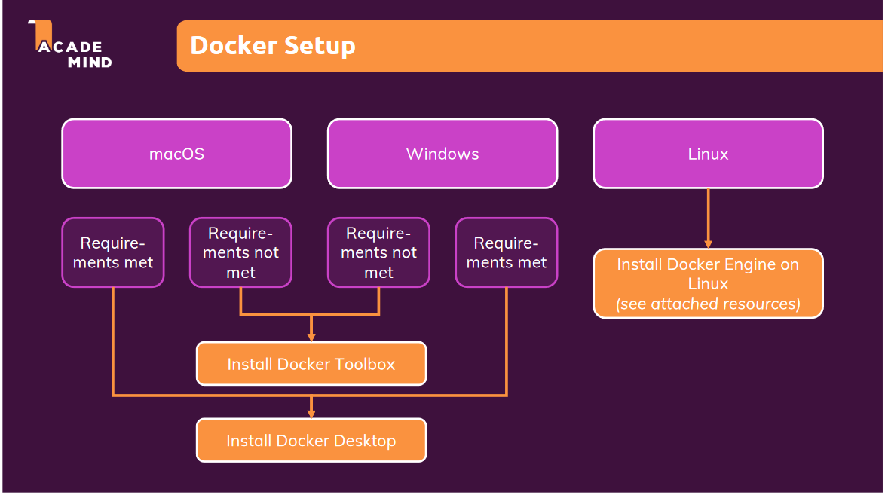
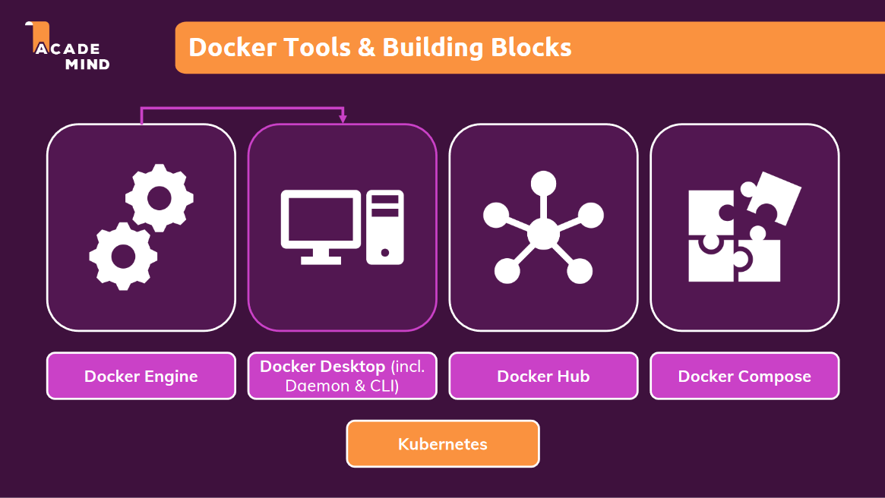

# Docker

## What is Docker ?

- Docker is an open platform for developing, shipping, and running applications.
- Docker is a container technology: A tool for creating and managing containers
- The whole idea of Docker is for developers to easily develop applications, ship them into containers which can then be deployed anywhere.

## What is conatiners ?

- A standardized unit of software.
- A package of code and dependencies to run that code (e.g. NodeJS code + the NodeJS runtime)

> Same container always yields the exact same application and execution behaviour! No matter where or by whom it might be executed.

## Why containers ?

- There are some potential problems dealing with development and production environment while building and deploying our appliaction which we wanna solve and these are :

### Problem

### What we want ?

### Solution: Virtual Machines vs Container

- *Virtual Machines : Machines running on another machine.*
- Virtual Machines with virtual operating systems encapsulated in their own shell independent from our host operating system.
- With VM we have host OS and top of that we install the VM. Installed VM has it's own virtual OS runs inside of that VM. We can install extra tools inside VM and libraries & dependencies , also move our source code .
- We can have multiple such environment and share our VM configuration.
- But, still there are couple of problems.
- Biggest problem is the VM OS. Every VM is like a standalone computer and machine running on top of our machine.
- If we have multiple such machines we have a lot of wasted space and resources.
- Because everytime we have to setup a new VM inside our host machine.It will eats up Memory, CPU and space on hard drive.
- It will duplicate the OS as we will setup each VM separately.

### Pros and Cons of VM

## Best Solution: Docker and Container

- With Conatiners we still have our host OS but we don't install a couple of machines in the machine. Instead, we utilise built-in container support of OS. Then we run a tool called "Docker Engine" on top of that. It will setup by docker when we install it.
- Based on Docker Engine, a lightweight tool we can create conatiners . And these conatiners contains the code and all the dependecies to run th code.
- They don't conatin a bloated OS and tons of extra tools .
- They might have a small-layer-of OS inside the container but that will be a light weighted version.

> Note: We can configure container and describe them with a configuration file and share the file with others inorder to recreate the conatiners OR we can build the conatiner into "image" and share that image with others to ensure that same container can be launched which we have on our system .

## Containers VS Virtual Machines

## Docker Setup

## Docker Tools

